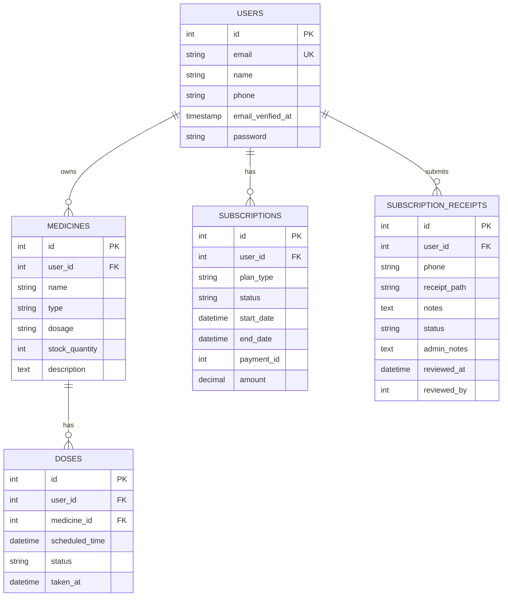

# 🏗 البنية المعمارية - MediRemind

هذا المستند يشرح البنية المعمارية الكاملة للمشروع وفقاً لـ **Clean Architecture** و **SOLID Principles**.

---

## 📋 المحتويات

1. [نظرة عامة](#نظرة-عامة)
2. [Layered Architecture](#layered-architecture)
3. [Design Patterns](#design-patterns)
4. [Database Schema](#database-schema)
5. [Request Flow](#request-flow)
6. [Services Architecture](#services-architecture)
7. [Security](#security)

---

## نظرة عامة

MediRemind مبني على **Laravel 11** باستخدام:

- ✅ **Clean Architecture** - فصل Concerns
- ✅ **Repository Pattern** - Data Access abstraction
- ✅ **Service Layer** - Business Logic
- ✅ **Policy Pattern** - Authorization
- ✅ **Observer Pattern** - Events & Listeners
- ✅ **Strategy Pattern** - SMS Providers

---

## Layered Architecture

```
┌─────────────────────────────────────────┐
│         Presentation Layer              │
│   (Controllers, Views, API Resources)   │
└─────────────────────────────────────────┘
                  ↓
┌─────────────────────────────────────────┐
│         Application Layer               │
│     (Services, Form Requests)           │
└─────────────────────────────────────────┘
                  ↓
┌─────────────────────────────────────────┐
│         Domain Layer                    │
│    (Models, Policies, Events)           │
└─────────────────────────────────────────┘
                  ↓
┌─────────────────────────────────────────┐
│         Infrastructure Layer            │
│  (Database, External APIs, Queue)       │
└─────────────────────────────────────────┘
```

### 1. Presentation Layer

**المسؤولية:** عرض البيانات وتلقي الـ Input

```
app/Http/
├── Controllers/
│   ├── Api/           # API Endpoints
│   │   ├── AuthController.php
│   │   ├── MedicineController.php
│   │   ├── DoseController.php
│   │   └── SubscriptionController.php
│   └── Web/           # Web Pages
│       ├── MedicineController.php
│       └── SubscriptionController.php
│
resources/views/       # Blade Templates
│
app/Http/Resources/    # API Response Formatting
├── UserResource.php
└── MedicineResource.php
```

### 2. Application Layer

**المسؤولية:** Business Logic & Validation

```
app/Services/
├── NotificationService.php      # إدارة الإشعارات
├── SubscriptionService.php      # منطق الاشتراكات
└── Notifications/
    ├── SmsProviderInterface.php # Interface
    ├── TwilioSmsProvider.php    # Implementation
    └── CustomSmsProvider.php    # Implementation

app/Http/Requests/
├── StoreMedicineRequest.php
└── UpdateDoseRequest.php
```

### 3. Domain Layer

**المسؤولية:** Core Business Entities

```
app/Models/
├── User.php
├── Medicine.php
├── Dose.php
├── Subscription.php
└── SubscriptionReceipt.php

app/Policies/
├── MedicinePolicy.php
└── DosePolicy.php
```

### 4. Infrastructure Layer

**المسؤولية:** External Dependencies

```
database/migrations/
config/services.php     # External APIs config
app/Console/Commands/   # Cron Jobs
```

---

## Design Patterns

### 1. Repository Pattern

**الهدف:** فصل Data Access عن Business Logic

```php
// Example (سيتم تطبيقه لاحقاً)
interface MedicineRepositoryInterface
{
    public function all();
    public function find($id);
    public function create(array $data);
    public function update($id, array $data);
    public function delete($id);
}

class MedicineRepository implements MedicineRepositoryInterface
{
    public function all()
    {
        return Medicine::with('doses')->get();
    }
    
    // ... implementation
}
```

### 2. Service Layer Pattern

**الهدف:** تجميع Business Logic

```php
class NotificationService
{
    protected $smsProvider;
    
    public function __construct(SmsProviderInterface $smsProvider)
    {
        $this->smsProvider = $smsProvider;
    }
    
    public function sendMedicineReminder($phone, $medicine, $time, $user)
    {
        // 1. Check subscription
        if (!$this->hasActiveSubscription($user)) {
            return false;
        }
        
        // 2. Prepare message
        $message = $this->prepareMedicineReminderMessage($medicine, $time);
        
        // 3. Send
        return $this->smsProvider->send($phone, $message);
    }
}
```

### 3. Strategy Pattern (SMS Providers)

**الهدف:** سهولة تبديل مزودي SMS

```php
// Interface
interface SmsProviderInterface
{
    public function send(string $to, string $message): bool;
    public function getName(): string;
    public function isConfigured(): bool;
}

// Implementations
class TwilioSmsProvider implements SmsProviderInterface { }
class CustomSmsProvider implements SmsProviderInterface { }

// Usage
$provider = match(config('services.sms_provider')) {
    'twilio' => new TwilioSmsProvider(),
    'custom' => new CustomSmsProvider(),
};
```

### 4. Observer Pattern (Events)

```php
// Event
class MedicineCreated
{
    public $medicine;
    
    public function __construct(Medicine $medicine)
    {
        $this->medicine = $medicine;
    }
}

// Listener
class SendMedicineCreatedNotification
{
    public function handle(MedicineCreated $event)
    {
        // Send notification
    }
}

// في EventServiceProvider
protected $listen = [
    MedicineCreated::class => [
        SendMedicineCreatedNotification::class,
    ],
];
```

---

## Database Schema



### الجداول الرئيسية

#### 1. users
```sql
CREATE TABLE users (
    id SERIAL PRIMARY KEY,
    name VARCHAR(255) NOT NULL,
    email VARCHAR(255) UNIQUE NOT NULL,
    phone VARCHAR(255),
    email_verified_at TIMESTAMP,
    password VARCHAR(255) NOT NULL,
    remember_token VARCHAR(100),
    created_at TIMESTAMP,
    updated_at TIMESTAMP
);
```

#### 2. medicines
```sql
CREATE TABLE medicines (
    id SERIAL PRIMARY KEY,
    user_id INT NOT NULL REFERENCES users(id) ON DELETE CASCADE,
    name VARCHAR(255) NOT NULL,
    type VARCHAR(255),
    dosage VARCHAR(255),
    stock_quantity INT DEFAULT 0,
    description TEXT,
    created_at TIMESTAMP,
    updated_at TIMESTAMP
);
```

#### 3. doses
```sql
CREATE TABLE doses (
    id SERIAL PRIMARY KEY,
    user_id INT NOT NULL REFERENCES users(id) ON DELETE CASCADE,
    medicine_id INT NOT NULL REFERENCES medicines(id) ON DELETE CASCADE,
    scheduled_time TIMESTAMP NOT NULL,
    status VARCHAR(50) DEFAULT 'pending',
    taken_at TIMESTAMP,
    notes TEXT,
    created_at TIMESTAMP,
    updated_at TIMESTAMP
);
```

#### 4. subscriptions
```sql
CREATE TABLE subscriptions (
    id SERIAL PRIMARY KEY,
    user_id INT NOT NULL REFERENCES users(id) ON DELETE CASCADE,
    plan_type VARCHAR(50) NOT NULL,
    status VARCHAR(50) DEFAULT 'active',
    start_date TIMESTAMP NOT NULL,
    end_date TIMESTAMP,
    payment_id INT,
    amount DECIMAL(10,2) DEFAULT 0,
    created_at TIMESTAMP,
    updated_at TIMESTAMP
);
```

#### 5. subscription_receipts
```sql
CREATE TABLE subscription_receipts (
    id SERIAL PRIMARY KEY,
    user_id INT NOT NULL REFERENCES users(id) ON DELETE CASCADE,
    phone VARCHAR(255) NOT NULL,
    receipt_path VARCHAR(255) NOT NULL,
    notes TEXT,
    status VARCHAR(50) DEFAULT 'pending',
    admin_notes TEXT,
    reviewed_at TIMESTAMP,
    reviewed_by INT REFERENCES users(id),
    created_at TIMESTAMP,
    updated_at TIMESTAMP
);
```

---

## Request Flow

### 1. Web Request Flow

```
User Browser
    ↓
routes/web.php
    ↓
Middleware (auth, verified)
    ↓
Controller
    ↓
Form Request (validation)
    ↓
Service Layer (business logic)
    ↓
Model / Repository
    ↓
Database
    ↓
Response → Blade View
    ↓
User Browser
```

### 2. API Request Flow

```
Mobile App / API Client
    ↓
routes/api.php
    ↓
Middleware (auth:sanctum)
    ↓
API Controller
    ↓
Form Request (validation)
    ↓
Service Layer
    ↓
Model
    ↓
Database
    ↓
API Resource (formatting)
    ↓
JSON Response
    ↓
Mobile App
```

### 3. Background Job Flow (Reminders)

```
Laravel Scheduler (Cron)
    ↓
SendMedicationReminders Command
    ↓
Query pending doses (scheduled_time = now)
    ↓
For each dose:
    1. Check user has active subscription
    2. Prepare notification
    3. Send via NotificationService
    4. Log result
```

---

## Services Architecture

### NotificationService

**الغرض:** إدارة جميع أنواع الإشعارات

```php
class NotificationService
{
    // Dependencies
    protected SmsProviderInterface $smsProvider;
    
    // Methods
    public function sendSms($to, $message, $user = null)
    public function sendWhatsApp($to, $message, $user = null)
    public function sendMedicineReminder($phone, $medicine, $time, $user)
    public function sendLowStockAlert($phone, $medicine, $remaining, $user)
    public function sendSubscriptionConfirmation($phone, $planName)
    
    // Private helpers
    protected function hasActiveSubscription($user)
    protected function getSmsProvider()
    protected function isWhatsAppConfigured()
}
```

**Usage:**
```php
$notificationService = app(NotificationService::class);
$notificationService->sendMedicineReminder(
    $user->phone,
    'Paracetamol',
    '08:00 AM',
    $user
);
```

---

## Security

### 1. Authentication

```php
// Sanctum for API
config/sanctum.php

// Session for Web
config/session.php
```

### 2. Authorization (Policies)

```php
class MedicinePolicy
{
    public function view(User $user, Medicine $medicine)
    {
        return $user->id === $medicine->user_id;
    }
    
    public function update(User $user, Medicine $medicine)
    {
        return $user->id === $medicine->user_id;
    }
    
    public function delete(User $user, Medicine $medicine)
    {
        return $user->id === $medicine->user_id;
    }
}
```

### 3. CSRF Protection

```blade
<form method="POST">
    @csrf
    <!-- form fields -->
</form>
```

### 4. Rate Limiting

```php
// في routes/api.php
Route::middleware(['throttle:60,1'])->group(function () {
    // API routes
});
```

### 5. Input Validation

```php
class StoreMedicineRequest extends FormRequest
{
    public function rules()
    {
        return [
            'name' => 'required|string|max:255',
            'type' => 'nullable|string|max:255',
            'dosage' => 'required|string|max:255',
            'stock_quantity' => 'required|integer|min:0',
        ];
    }
}
```

---

## Clean Code Principles Applied

### 1. Single Responsibility Principle (SRP)

```php
// ❌ قبل
class MedicineController
{
    public function store(Request $request)
    {
        // Validation
        $validated = $request->validate([...]);
        
        // Business logic
        if ($validated['stock'] < 10) {
            // Send alert
        }
        
        // Database
        Medicine::create($validated);
        
        // Notification
        $this->sendEmail(...);
    }
}

// ✅ بعد
class MedicineController
{
    public function store(StoreMedicineRequest $request, MedicineService $service)
    {
        $medicine = $service->create($request->validated());
        return redirect()->route('medicines.index');
    }
}
```

### 2. Dependency Injection

```php
// ✅ Good
class NotificationService
{
    public function __construct(
        protected SmsProviderInterface $smsProvider
    ) {}
}

// في Service Provider
$this->app->bind(SmsProviderInterface::class, function () {
    return match(config('services.sms_provider')) {
        'twilio' => new TwilioSmsProvider(),
        'custom' => new CustomSmsProvider(),
    };
});
```

### 3. Interface Segregation

```php
// ✅ Focused interfaces
interface SmsProviderInterface
{
    public function send(string $to, string $message): bool;
}

interface WhatsAppProviderInterface
{
    public function send(string $to, string $message): bool;
}

// بدلاً من واحد كبير
interface MessageProviderInterface
{
    public function sendSms(...);
    public function sendWhatsApp(...);
    public function sendEmail(...);  // ❌ Too much
}
```

---

## Future Improvements

### 1. Repository Pattern (Planned)
```php
app/Repositories/
├── MedicineRepository.php
├── DoseRepository.php
└── SubscriptionRepository.php
```

### 2. Event Sourcing (Planned)
```php
app/Events/
├── MedicineCreated.php
├── DoseTaken.php
└── SubscriptionApproved.php
```

### 3. API Versioning
```php
routes/api/
├── v1.php
└── v2.php
```

### 4. Caching Layer
```php
Cache::remember('user_medicines_' . $userId, 3600, function () {
    return Medicine::where('user_id', $userId)->get();
});
```

---

## Testing Strategy

### 1. Unit Tests
```php
tests/Unit/
├── Services/
│   └── NotificationServiceTest.php
└── Models/
    └── MedicineTest.php
```

### 2. Feature Tests
```php
tests/Feature/
├── Auth/
│   └── LoginTest.php
└── Medicines/
    └── CreateMedicineTest.php
```

### 3. Browser Tests (Dusk)
```php
tests/Browser/
└── SubscriptionFlowTest.php
```

---

## Performance Optimization

### 1. Database Optimization

```php
// ✅ Eager Loading
Medicine::with('doses')->get();

// ✅ Index على الأعمدة المستخدمة كثيراً
$table->index('user_id');
$table->index('scheduled_time');
```

### 2. Query Optimization

```php
// ❌ N+1 Problem
foreach ($medicines as $medicine) {
    echo $medicine->user->name;
}

// ✅ Solution
$medicines = Medicine::with('user')->get();
```

### 3. Caching

```php
// Config caching
php artisan config:cache

// Route caching
php artisan route:cache

// View caching
php artisan view:cache
```

---

## Deployment Architecture

```
┌─────────────────────────────────────────┐
│         Load Balancer (Nginx)           │
└─────────────────────────────────────────┘
                  ↓
┌─────────────────────────────────────────┐
│         Laravel App (PHP-FPM)           │
│   - Web Requests                        │
│   - API Requests                        │
└─────────────────────────────────────────┘
                  ↓
┌─────────────────────────────────────────┐
│         PostgreSQL Database             │
└─────────────────────────────────────────┘

┌─────────────────────────────────────────┐
│         Queue Worker (Supervisor)       │
│   - Process Jobs                        │
└─────────────────────────────────────────┘

┌─────────────────────────────────────────┐
│         Scheduler (Cron)                │
│   - Medication Reminders                │
│   - Stock Alerts                        │
└─────────────────────────────────────────┘

┌─────────────────────────────────────────┐
│         Redis Cache                     │
└─────────────────────────────────────────┘
```

---

## Monitoring & Logging

### 1. Logging
```php
Log::channel('slack')->error('Payment failed', [
    'user_id' => $userId,
    'amount' => $amount
]);
```

### 2. Error Tracking
- Laravel Telescope (Development)
- Sentry (Production)

### 3. Performance Monitoring
- Laravel Debugbar (Development)
- New Relic / DataDog (Production)

---

## 📞 للتطوير والدعم

- **Email:** ydm07652@gmail.com
- **GitHub:** [mohamidEid/Medication-ReminderProject](https://github.com/mohamidEid/Medication-ReminderProject)

---

**آخر تحديث:** 2025-12-24  
**الإصدار:** 1.0.0
