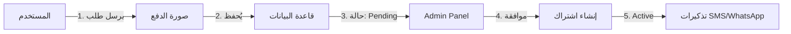

# 💊 MediRemind - نظام تذكير الأدوية الذكي

[](https://laravel.com)
[](https://php.net)
[](LICENSE)

نظام ذكي ومتكامل لإدارة وتذكير الأدوية مع دعم الإشعارات عبر SMS وWhatsApp.

---

## 📋 المحتويات

- [نظرة عامة](#-نظرة-عامة)
- [المميزات الرئيسية](#-المميزات-الرئيسية)
- [التقنيات المستخدمة](#-التقنيات-المستخدمة)
- [التثبيت السريع](#-التثبيت-السريع)
- [الهيكلة المعمارية](#-الهيكلة-المعمارية)
- [الاستخدام](#-الاستخدام)
- [API Documentation](#-api-documentation)
- [نظام الاشتراكات](#-نظام-الاشتراكات)
- [الإشعارات الذكية](#-الإشعارات-الذكية)
- [الصلاحيات والأدوار](#-الصلاحيات-والأدوار)
- [المساهمة](#-المساهمة)

---

## 🎯 نظرة عامة

**MediRemind** هو نظام شامل لإدارة الأدوية والتذكير بمواعيدها، مصمم خصيصاً للمرضى الذين يحتاجون إلى متابعة دقيقة لجداول الأدوية الخاصة بهم.

### 🌟 لماذا MediRemind؟

- ✅ **تذكيرات ذكية** - إشعارات تلقائية عبر SMS/WhatsApp
- ✅ **إدارة متقدمة** - تتبع المخزون وتنبيهات النفاد
- ✅ **نظام اشتراكات** - موافقة تلقائية ومرنة
- ✅ **لوحة تحكم قوية** - Filament Admin Panel
- ✅ **API كامل** - للتكامل مع تطبيقات الموبايل

---

## 🚀 المميزات الرئيسية

### 1️⃣ إدارة الأدوية
- إضافة/تعديل/حذف الأدوية
- تتبع المخزون الحالي
- تنبيهات نقص المخزون
- تصنيف الأدوية حسب النوع

### 2️⃣ جدولة الجرعات
- جدول زمني مرن للجرعات
- تذكيرات تلقائية
- تتبع الجرعات المأخوذة/المفقودة
- إحصائيات الالتزام

### 3️⃣ نظام الإشعارات الذكي
- **SMS Notifications** - عبر Twilio أو Custom Provider
- **WhatsApp Integration** - تذكيرات عبر WhatsApp
- **التحكم بالاشتراك** - الإشعارات فقط للمشتركين
- **تخصيص الرسائل** - رسائل مخصصة حسب نوع التذكير

### 4️⃣ نظام الاشتراكات
- **طلب اشتراك** - رفع صورة الدفع
- **موافقة تلقائية** - من لوحة Admin
- **تتبع الاشتراك** - عرض تاريخ الانتهاء والأيام المتبقية
- **تجديد سلس** - إعادة الطلب بعد الرفض

### 5️⃣ لوحة تحكم المدير (Filament)
- إدارة المستخدمين والأدوية
- موافقة/رفض طلبات الاشتراك
- عرض الإحصائيات
- إدارة الصلاحيات (Spatie Permissions)

---

## 🛠 التقنيات المستخدمة

### Backend
- **Laravel 11.x** - PHP Framework
- **PostgreSQL/MySQL** - Database
- **Filament 4.x** - Admin Panel
- **Spatie Laravel Permission** - Role Management
- **Twilio** - SMS/WhatsApp Provider

### Frontend
- **Blade Templates** - طريق Web
- **TailwindCSS** - Modern Styling
- **Alpine.js** - Interactivity
- **Lucide Icons** - SVG Icons

### Infrastructure
- **Docker & Docker Compose** - Containerization
- **Laravel Scheduler** - Cron Jobs
- **Queue System** - Background Jobs


#### PHP Advanced
1. ✅ **Match Expression** - بديل switch
2. ✅ **Type Declarations** - Return Types, Property Types
3. ✅ **Constructor Property Promotion** - PHP 8 shortcut
4. ✅ **Null Safe Operator** - `?->`
5. ✅ **Named Arguments** - Readable code

#### Design Patterns
6. ✅ **Strategy Pattern** - SMS Providers
7. ✅ **Observer Pattern** - Eloquent Events
8. ✅ **Factory Pattern** - Object Creation
9. ✅ **Repository Pattern** - (جزئي)

#### Security
10. ✅ **Mass Assignment Protection** - fillable/guarded
11. ✅ **CSRF Protection**

#### Performance
12. ✅ **Caching** - Config, Route, View
13. ✅ **Query Optimization** - Eager Loading, Chunking


---

## ⚡ التثبيت السريع

### المتطلبات
- PHP 8.2+
- Composer
- PostgreSQL/MySQL
- Node.js & NPM

### خطوات التثبيت

```bash
# 1. Clone المشروع
git clone https://github.com/your-username/MediRemind.git
cd MediRemind

# 2. Server Setup
cd server
composer install
cp .env.example .env
php artisan key:generate

# 3. Database Setup
php artisan migrate
php artisan db:seed

# 4. Create Admin User
php artisan tinker
>>> $user = User::create(['email' => 'admin@mediremind.com', 'name' => 'Admin', 'password' => bcrypt('admin123'), 'phone' => '+201234567890']);
>>> $user->assignRole('super_admin');

# 5. Run Server
php artisan serve

# 6. Setup Cron (للتذكيرات)
php artisan schedule:work
```

### 🐳 باستخدام Docker

```bash
# بناء وتشغيل الحاويات
docker-compose up -d

# تشغيل Migrations
docker-compose exec app php artisan migrate --seed
```

---

## 🏗 الهيكلة المعمارية

```
MediRemind/
├── server/                    # Laravel Backend
│   ├── app/
│   │   ├── Console/
│   │   │   └── Commands/      # Cron Commands
│   │   ├── Filament/          # Admin Panel
│   │   │   ├── Pages/
│   │   │   ├── Resources/
│   │   │   └── Widgets/
│   │   ├── Http/
│   │   │   ├── Controllers/
│   │   │   │   ├── Api/       # API Controllers
│   │   │   │   └── *.php      # Web Controllers
│   │   │   └── Requests/      # Form Validations
│   │   ├── Models/            # Eloquent Models
│   │   ├── Notifications/     # Notification Classes
│   │   ├── Policies/          # Authorization
│   │   └── Services/          # Business Logic
│   │       └── Notifications/ # SMS Providers
│   ├── database/
│   │   ├── migrations/
│   │   └── seeders/
│   ├── resources/
│   │   └── views/             # Blade Templates
│   └── routes/
│       ├── api.php            # API Routes
│       └── web.php            # Web Routes
├── docker/                    # Docker Config
├── docs/                      # Documentation
└── README.md                  # هذا الملف
```

**للمزيد من التفاصيل:** راجع [ARCHITECTURE.md](./ARCHITECTURE.md)

---

## 📖 الاستخدام

### للمستخدمين

#### 1. التسجيل والدخول
```
الرابط: http://localhost:8000/register
البريد: user@example.com
الرقم السري: (اختر رقمك)
```

#### 2. إضافة دواء جديد
```
الرابط: http://localhost:8000/medicines
1. اضغط "إضافة دواء جديد"
2. املأ البيانات (الاسم، النوع، الجرعة، المخزون)
3. احفظ
```

#### 3. جدولة التذكيرات
```
الرابط: http://localhost:8000/medicines/{id}/schedule
1. اختر الأوقات (صباح، ظهر، مساء)
2. حدد عدد مرات التكرار
3. احفظ الجدول
```

#### 4. الاشتراك للحصول على التذكيرات
```
الرابط: http://localhost:8000/subscription
1. ادفع 100 جنيه (فودافون كاش: 01027931470)
2. ارفع صورة الإيصال
3. انتظر الموافقة (خلال 5 دقائق)
4. استمتع بالتذكيرات!
```

### للإداريين

#### 1. الدخول للوحة التحكم
```
الرابط: http://localhost:8000/admin
البريد: admin@mediremind.com
الرقم السري: admin123
```

#### 2. موافقة طلبات الاشتراك
```
المسار: Admin > طلبات الاشتراك
1. افتح الطلب
2. اضغط "موافقة"
3. يتم تفعيل الاشتراك تلقائياً
```

#### 3. اختبار SMS/WhatsApp
```
المسار: Admin > اختبار SMS
1. أدخل رقم الهاتف
2. اكتب الرسالة
3. أرسل
```

---

## 🔌 API Documentation

### Authentication
جميع الـ API endpoints تتطلب `Bearer Token`:

```bash
# الحصول على Token
POST /api/login
{
  "email": "user@example.com",
  "password": "password"
}

Response:
{
  "token": "YOUR_ACCESS_TOKEN",
  "user": {...}
}
```

### Endpoints الرئيسية

#### المستخدمين
```
POST   /api/register        # تسجيل مستخدم جديد
POST   /api/login           # تسجيل الدخول
POST   /api/logout          # تسجيل الخروج
GET    /api/profile         # بيانات المستخدم
PUT    /api/profile         # تحديث البيانات
```

#### الأدوية
```
GET    /api/medicines       # قائمة الأدوية
POST   /api/medicines       # إضافة دواء
GET    /api/medicines/{id}  # تفاصيل دواء
PUT    /api/medicines/{id}  # تحديث دواء
DELETE /api/medicines/{id}  # حذف دواء
```

#### الجرعات
```
GET    /api/doses           # الجرعات المجدولة
POST   /api/doses           # جدولة جرعة
PUT    /api/doses/{id}/take # تأكيد أخذ الجرعة
PUT    /api/doses/{id}/skip # تخطي الجرعة
```

#### الاشتراكات
```
POST   /api/subscriptions   # طلب اشتراك جديد
GET    /api/subscriptions   # حالة الاشتراك الحالي
```

**للتفاصيل الكاملة:** راجع [API_DOCUMENTATION.md](./docs/old/API_DOCUMENTATION.md)

---

## 💳 نظام الاشتراكات

### كيف يعمل؟



### الحالات Possible

| الحالة | الوصف | الإجراء التالي |
|--------|-------|----------------|
| `pending` | قيد المراجعة | ينتظر موافقة الأدمن |
| `approved` | معتمد | اشتراك نشط |
| `rejected` | مرفوض | يمكن إعادة الطلب |
| `active` | نشط | التذكيرات تعمل |
| `expired` | منتهي | يجب التجديد |

### السعر
- **100 جنيه** شهرياً
- **دفع فودافون كاش:** `01027931470`

---

## 🔔 الإشعارات الذكية

### مزودو الخدمة المدعومون

#### 1. Twilio
```env
SMS_PROVIDER=twilio
TWILIO_SID=your_twilio_sid
TWILIO_AUTH_TOKEN=your_auth_token
TWILIO_PHONE_FROM=+1234567890
TWILIO_WHATSAPP_FROM=whatsapp:+14155238886
```

#### 2. Custom SMS Provider
```env
SMS_PROVIDER=custom
CUSTOM_SMS_API_KEY=your_api_key
CUSTOM_SMS_API_URL=https://api.example.com/send
CUSTOM_SMS_FROM=YourBrand
```

### أنواع الإشعارات

1. **تذكير بالدواء** 🔔
   ```
   حان موعد دواء باراسيتامول في 08:00 AM
   ```

2. **تنبيه المخزون** ⚠️
   ```
   دواء باراسيتامول على وشك النفاد
   الكمية المتبقية: 5
   ```

3. **تأكيد الاشتراك** ✅
   ```
   تم تفعيل اشتراكك في باقة MediRemind الشهرية بنجاح!
   ```

### شروط الإرسال

- ✅ **المستخدم لديه اشتراك نشط**
- ✅ **تاريخ الانتهاء في المستقبل**
- ✅ **رقم الهاتف مسجل**

**للمزيد:** راجع [SUBSCRIPTION_REMINDERS.md](./docs/old/SUBSCRIPTION_REMINDERS.md)

---

## 🔐 الصلاحيات والأدوار

### الأدوار المتاحة

| الدور | الصلاحيات |
|-------|-----------|
| `super_admin` | كل شيء |
| `admin` | إدارة + موافقات |
| `user` | استخدام عادي |

### الصلاحيات (49 صلاحية)

```php
// مثال: الأدوية
view_medicines
create_medicines
edit_medicines
delete_medicines

// الجرعات
view_doses
create_doses
edit_doses
delete_doses

// الاشتراكات
view_subscriptions
approve_subscriptions
reject_subscriptions

// ... إلخ
```

**التفاصيل الكاملة:** راجع [PERMISSIONS_GUIDE.md](./docs/old/PERMISSIONS_GUIDE.md)

---

## 🤝 المساهمة

نرحب بمساهماتك! يرجى اتباع الخطوات التالية:

### 1. Fork المشروع
### 2. إنشاء Branch جديد
```bash
git checkout -b feature/AmazingFeature
```

### 3. Commit التغييرات
```bash
git commit -m 'Add some AmazingFeature'
```

### 4. Push للـ Branch
```bash
git push origin feature/AmazingFeature
```

### 5. فتح Pull Request

---

## 🐛 الإبلاغ عن المشاكل

تواجه مشكلة؟ راجع [ISSUES.md](./ISSUES.md) للحلول الشائعة.

أو افتح Issue جديد على GitHub.

---

## 📞 التواصل

- **البريد الإلكتروني:** ydm07652@gmail.com
- **الهاتف (فودافون كاش):** 01027931470
- **GitHub:** [mohamidEid/Medication-ReminderProject](https://github.com/mohamidEid/Medication-ReminderProject)

---

## 📄 الترخيص

هذا المشروع مرخص تحت [MIT License](LICENSE).

---

## 🙏 شكر خاص

- Laravel Team
- Filament Team
- Spatie Team
- Twilio
- جميع المساهمين

---

<div align="center">

**صُنع بـ ❤️ في مصر**

**MediRemind © 2025**

[](https://github.com/mohamidEid)
[](https://twitter.com/yourhandle)

</div>
